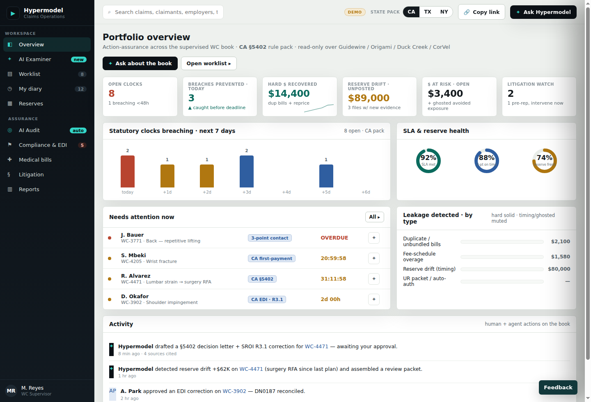
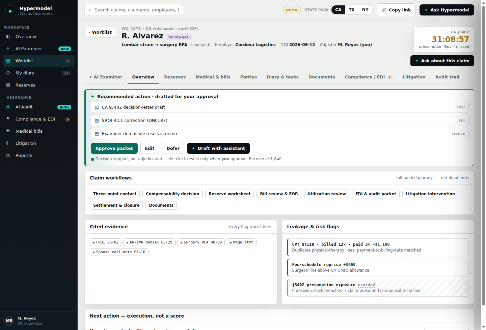
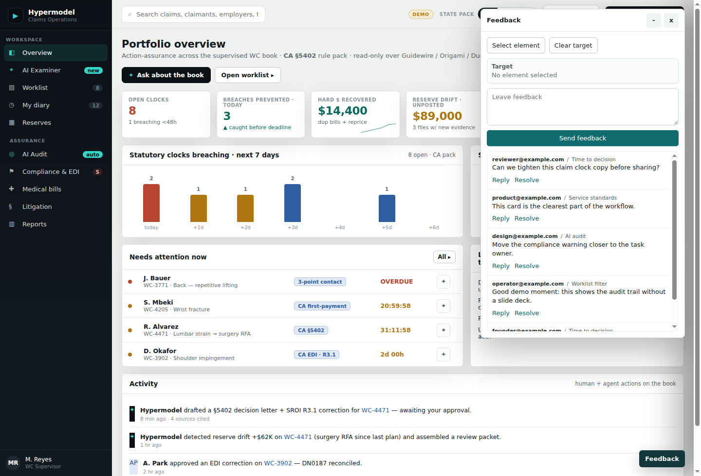
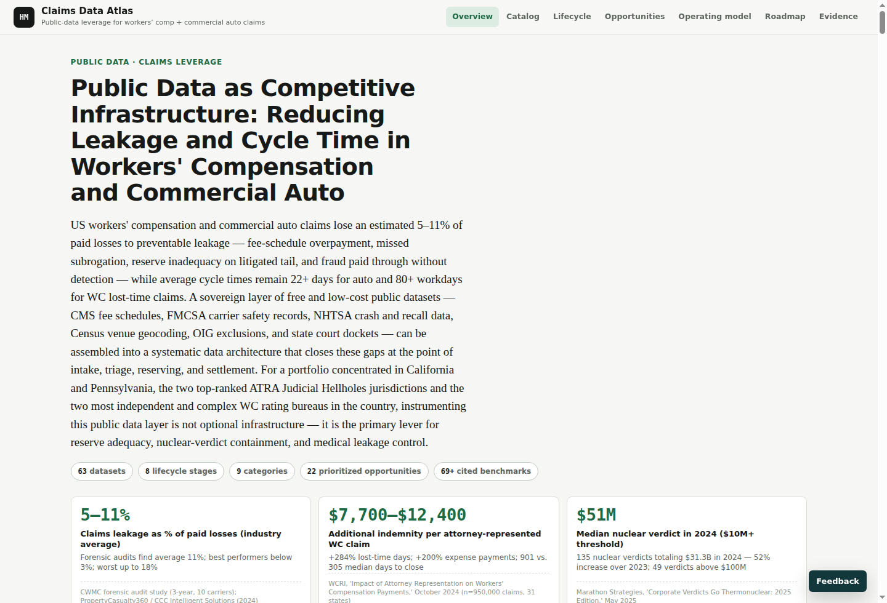

# Artifact Use

**Turn agent output into durable, reviewable web artifacts.**

Artifact Use is an open-source artifact store for coding agents and small teams.
Agents publish HTML tools, product prototypes, PDFs, images, videos, and complete
static folders through an MCP server or CLI. Artifact Use stores the files on
Cloudflare R2, tracks versions and viewer activity in D1, serves stable links,
and adds access gates plus comments on top.

The hosted dogfood deployment runs at:

```text
https://artifacts.iofold.com
```

## What You Can Make

Artifacts can be tiny single-file HTML tools or full folders with images,
scripts, PDFs, video, data files, and local libraries. The best artifacts tend
to follow the same pattern as durable HTML tools: no build step by default,
plain HTML/CSS/JS, URL-addressable state, localStorage for drafts and settings,
client-side parsing, canvas/SVG where useful, and assets kept beside the page
when the artifact needs more than one file.

### A Full Interactive Application

This artifact is a multi-screen claims operations console. It is still just a
static artifact: HTML, local JS modules, and bundled evidence assets served from
R2 behind one stable URL.



### Multi-File Workflows With Evidence

Folder artifacts can reference supporting PDFs, generated data modules, images,
videos, and other files without stuffing every byte into model context. Agents
can create an upload session, stream files directly to the Worker, then publish
the version atomically.



### Review And Comments On The Artifact Itself

Artifact Use adds a lightweight comments layer on top of hosted artifacts.
Reviewers can leave targeted comments, reply, and mark threads resolved without
the artifact needing to implement its own collaboration backend.



### Research Briefs, Tools, And Interactive Documents

Single-file artifacts are useful for research briefs, calculators, inspectors,
comparison tables, and other small tools that should survive beyond the chat
where they were generated.



## What Artifact Use Provides

- **Stable artifact URLs** under `/go/{artifact-slug}-{six-character-code}/`.
- **Immutable versions** with atomic current-version promotion.
- **Cloudflare-native storage** using Workers, R2, and D1.
- **Access gates**: `public`, `email`, `verified_email`, and `allowlist`.
- **Rich link previews** with public-safe Open Graph/X metadata, branded
  1200×630 cards, and a distinct artifact favicon—even when content is gated.
- **Viewer attribution** through email gates and share links.
- **Comments** with replies, resolve/reopen, and targeted
  element selection.
- **Publisher dashboard** with artifact lists, stats, recent views, share links,
  access controls, editable link previews, and team invitations.
- **Hosted HTTP MCP endpoint** with OAuth and bearer authentication.
- **Local stdio MCP server** for agents that need to walk and publish folders
  from disk.
- **JSON-first CLI** for shell workflows and direct uploads.
- **No agent-side Cloudflare credentials**. Agents publish through Artifact Use;
  the Worker owns R2/D1 access.

## Connect An Agent

The admin's **Connect an agent** page gives you one short, harness-neutral
handoff. Its creator token appears once, and it points the agent to
[`/llms.txt`](https://artifacts.iofold.com/llms.txt) to select exactly one setup
path.

### Codex Desktop, CLI, And IDE: Hosted MCP With OAuth

Codex desktop, CLI, and the IDE extension share MCP configuration and OAuth
credentials on the same host, so configure Artifact Use once with URL-only
OAuth.

In the ChatGPT desktop app, open **Settings → MCP servers → Add server**. Name
the server `artifact-use`, choose **Streamable HTTP**, enter
`https://artifacts.iofold.com/mcp`, then select **Save → Restart →
Authenticate**. Confirm the connection with `/mcp`.

The CLI equivalent is:

```bash
codex mcp add artifact-use --url https://artifacts.iofold.com/mcp
codex mcp login artifact-use
```

This OAuth path does not use the creator token from the handoff. If an existing
`artifact-use` config contains `bearer_token_env_var`, remove that setting (or
remove and re-add the server URL-only) before login: Codex tries a configured
bearer token before OAuth.

#### Codex CLI Bearer Fallback

Use bearer auth only when Codex OAuth is unavailable or unreliable. The token
must exist in the terminal that launches Codex:

```bash
export ARTIFACT_USE_TOKEN='au_creator_...'
codex mcp remove artifact-use
codex mcp add artifact-use \
  --url https://artifacts.iofold.com/mcp \
  --bearer-token-env-var ARTIFACT_USE_TOKEN
codex
```

Restart Codex after changing auth modes. Exporting the token inside an
already-running Codex shell cannot change the parent Codex process environment.

### Claude Code: Hosted MCP With OAuth

```bash
claude mcp add --transport http \
  artifact-use https://artifacts.iofold.com/mcp
```

Then open `/mcp` in Claude Code, select `artifact-use`, and choose
**Authenticate**. This path does not use the creator token from the handoff.

Other clients should prefer hosted MCP OAuth. If the client cannot complete MCP
OAuth, configure the same hosted MCP URL with the supplied creator token as its
bearer credential. Do not configure OAuth and bearer auth at the same time.

Tokenless agents can self-serve with the connect flow; the agent itself does not
need a browser:

```text
POST /api/v1/connect/start            -> device_code + user_code + verification_url
(human approves the code at /admin/connect)
POST /api/v1/connect/poll             -> bearer token + short handoff prompt
```

### Advanced Fallbacks

The CLI, direct HTTP API, and bundled local stdio MCP server are available for
harnesses without hosted MCP support and for specialized shell workflows. They
use the same creator token:

```bash
export ARTIFACT_USE_API_BASE=https://artifacts.iofold.com
export ARTIFACT_USE_TOKEN=<artifact-use-creator-token>
```

For example, publish a folder with the CLI:

```bash
npm run cli -- publish-folder --json '{
  "artifact": "claims-demo",
  "title": "Claims Demo",
  "dir": "examples/simple-site",
  "gate_level": "email"
}'
```

The CLI walks the folder, creates a draft version, uploads every file through
service-owned HTTP endpoints, completes the version, and returns a live URL.

Hosted MCP exposes these main tools:

- `artifact_publish`: publish single HTML, small inline multi-file payloads, or
  a local `dir` when using the bundled stdio MCP.
- `artifact_upload_session`: create a short-lived direct upload session for
  folders and large or multi-file artifacts.
- `artifact_manage`: list artifacts, fetch stats, update access, and create
  share links, or use `set_preview` to edit the public title and summary. Use
  the returned `url_key` for exact management calls.
- `artifact_comments`: list, reply to, resolve, and reopen comment threads.

For large artifacts, use the direct upload flow. The server creates a short-lived
upload session, the agent uploads bytes with `PUT`, and the final manifest flips
the version live only after every referenced file exists.

## Repository Layout

```text
apps/worker/          Cloudflare Worker, D1 schema, R2 object serving
packages/cli/         Agent-friendly CLI for publishing and admin operations
packages/mcp-server/  Local stdio MCP server for folder publishing
skills/               Portable Artifact Use skill
plugins/              Codex plugin bundle
integrations/         MCP config examples
examples/             Small static folder used for smoke tests
docs/                 API, deployment, architecture, and migration notes
```

## Local Development

```bash
npm install
npm run check
npm run worker:dev
```

Run the CLI in JSON mode:

```bash
ARTIFACT_USE_TOKEN=... npm run cli -- schema --all
```

## Self-Hosting

Artifact Use is designed to run on Cloudflare with your own resources:

1. Create a Cloudflare D1 database and R2 bucket, and enable Browser Rendering.
2. Configure `apps/worker/wrangler.toml` for your account, domain, routes,
   D1 database, R2 bucket, Browser Rendering binding, and Email Sending binding.
3. Apply the D1 baseline migration.
4. Enable a Cloudflare Email Sending domain if you use `verified_email` gates.
5. Set Worker secrets for sessions and WorkOS.
6. Deploy the Worker.

```bash
cd apps/worker
npx wrangler d1 create artifact-use
npx wrangler r2 bucket create artifact-use
npx wrangler d1 migrations apply artifact-use --remote
npx wrangler email sending enable updates.example.com
npx wrangler secret put SESSION_SECRET
npx wrangler secret put WORKOS_CLIENT_ID
npx wrangler secret put WORKOS_API_KEY
npx wrangler deploy
```

See [docs/DEPLOY.md](docs/DEPLOY.md) for the full hosted setup, WorkOS redirect
configuration, MCP auth settings, and Cloudflare route notes.

## Open-Source Scope

The code is MIT licensed. The public repository contains the Worker, schema,
CLI, MCP server, skill, plugin bundle, and docs. Hosted-service configuration
such as WorkOS applications, Cloudflare account IDs, R2/D1 resources, Email
Sending domains, and production secrets remain deploy-time configuration.

Before publishing your own fork or hosted instance, replace the example routes
and WorkOS/AuthKit values in `apps/worker/wrangler.toml` and `.env` files with
your own environment values.
